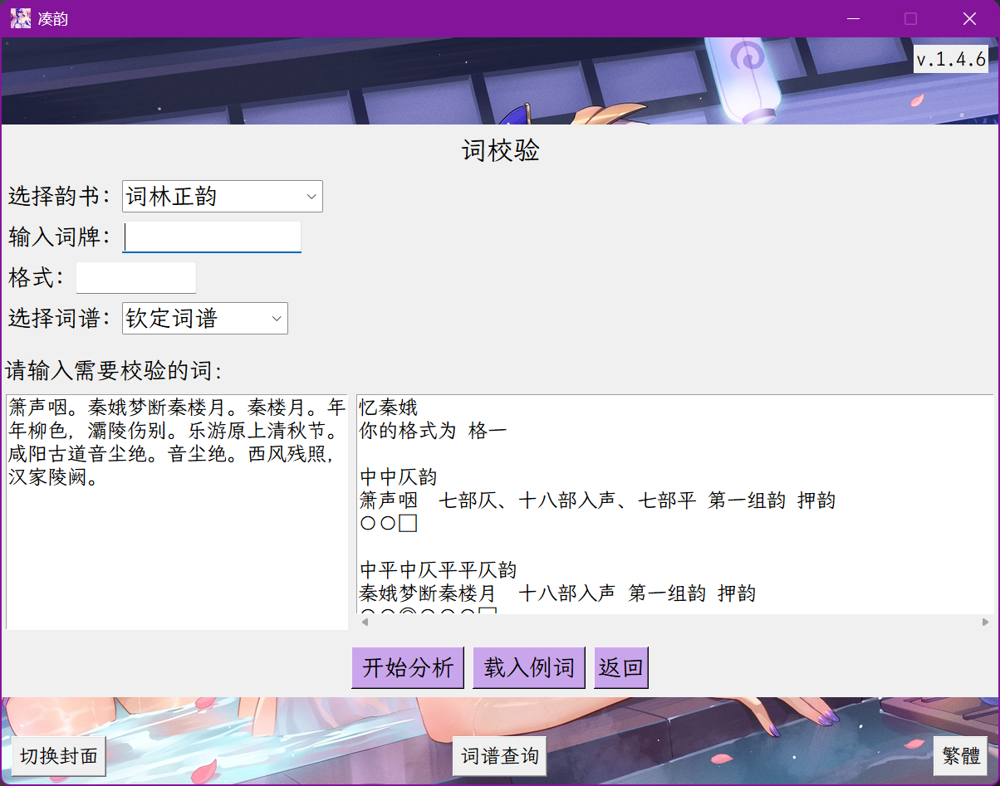
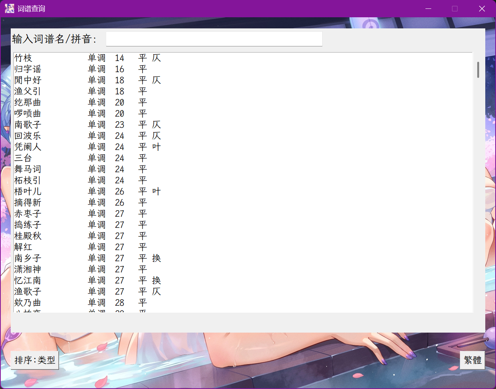
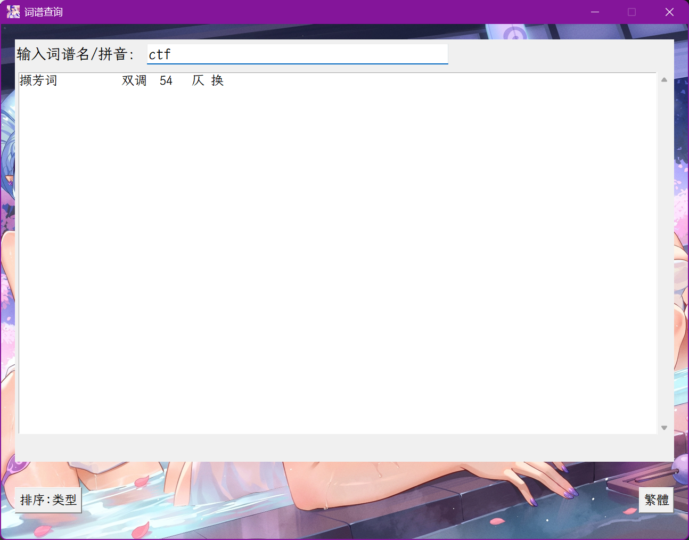
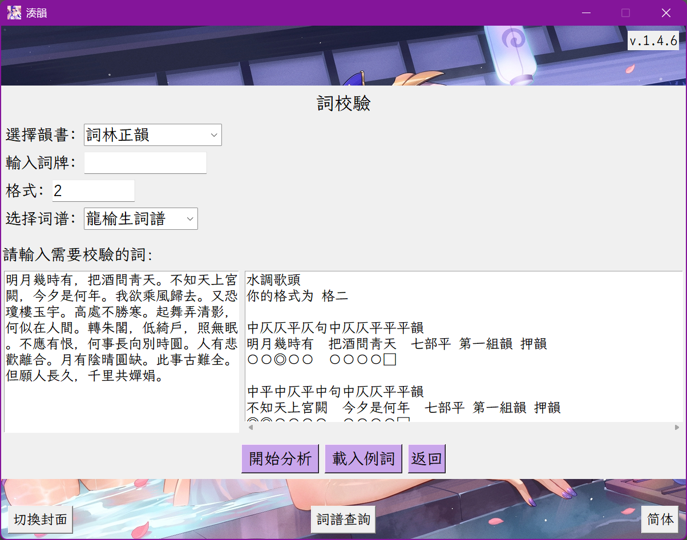

# 凑韵诗词格律检测工具

### 序
余早嗜诗，尝久事白话诗，不至于能，然亦小有所得。然于古韵，仍存敬畏，未敢涉足，盖因音律之道未得其门而入，自觉力有不逮。  
后因学东瀛语，始知其字有音读、训读二法，音读中又分吴、汉、唐，皆源自华夏古音，此所谓“域外音”也。各方言、域外音等，虽历经变迁，然于研究古音仍具管窥之效。余由此渐入佳境。  
格律者，音之规则也，其抑扬顿挫，华夏千年文化精髓半在其中。今人或有不屑，以为迂腐；或有畏难者，久难入门。所谓“靡不有初，鲜克有终”，如上种种，连“初”都难以迈出，更令人惋惜。 网上阐述格律精妙之处者众多，然余自愧词穷，难以尽述。  
近来忽有感悟，近体诗词前有珠玉，今人所作难以企及，但格律规则不过平仄游戏，规则既定，便可作程序判之。遂作一版，以飨诗友。因早有“搜韵网”在前，功能齐全，使用方便。余效仿之，绝不能及。诗友戏称“凑韵”。后屡次更新，以至于此。又作一《六州歌头》。以励余及众诗友：  

*诗骚并峙，从此鬼神惊。荆榛路，灵均骨，沉汨水，证嘉名。魏晋风霜烈，子建笔，嵇康曲，渊明酒，震雷霆。后人倾。李杜光辉万丈，鲸涛动，鹏翼垂溟。看香山古韵，爱者遍东瀛。诉尽平生。久回萦。*  
*更东坡酹，稼轩剑，易安絮，放翁情。西河忆，甘州望，扬州慨，万调荣。百代风雷荡，昆刀刻，雪泥铭。薪火继，江河涌，待新旌。莫叹焦桐古涩，律中随处有瑶琼。使云笺铺展，椽笔就辰星。试听新声。*  

## 使用方法：  
下载应用程序或按照requirements安装py库，运行couyun/ui/rhythm.py即可。分为3个模块。  
`pip install -r requirements.txt`

### 诗校验：  
输入五言或七言的律诗或绝句或排律，选择使用的韵书（默认为平水韵）程序会自动判断其所属的格式，并给出判断结果。输入的诗歌可以带标点以及括号内的注释，程序会自动忽略括号中的内容。并通过以下内容展示。  
“〇”当前字平仄正确，“◎”当前字属于多音字，“●”当前字平仄错误，“�”当前字不在韵书中，无法断定平仄韵部，对应的，“□”表示押韵，“■”表示不押韵。如分析杜甫的《绝句》：  

### 词校验 
#### 常规使用
输入一首词，你可以指定这首词的词牌（一个词牌可能有多种名称，如“贺新郎”又称为“乳燕飞”，“金缕曲”，部分词牌的别名也是支持的），若未指定则按照输入的句读自动匹配词牌。  
同时你也可以指定你所用的格式是《钦定词谱》或者《龙榆生词谱》的格几，使用数字表示，未指定或指定格式不存在则自动匹配。  
若在能够匹配词牌（或输入词牌无误且内容能够与词牌中的格式匹配），则会展示输出结果。 如分析李白的《忆秦娥》，在不输入词牌及格式的情况下结果，平仄展示结果与诗校验一致：  

#### 载入词谱
输入词牌名，指定格式与词谱，单击“载入词谱”，便可以将词谱内容载入至文本框中。
如《龙榆生词谱》中贺新郎使用了辛弃疾《别茂嘉十二弟》作为词谱，可以导入。

### 查字  
输入一个汉字，可以查询其在平水韵、词林正韵、中华新韵和中华通韵中的韵部。如查询字“涯”：  

## 词谱查询
单击词谱查询即可进入到词谱查询界面，词谱排序提供了依据字数，字数和类型，拼音等排序，可通过左下方按钮切换。

在上方搜索框中可以使用拼音，拼音首字母或者汉字查询词谱，部分词谱的别名也是可以的，如输入“钗头凤”会匹配到“撷芳词”。

在词谱的具体界面可以查询词谱的原始内容，如果有钦谱与龙谱，则可以通过上方按钮切换，否则只显示钦谱，此处以词谱“苏幕遮”演示。

## 其他功能
### 繁简切换
在主界面可以选择切换繁体/简体，程序会记录切换的状态，再次打开程序时程序会读取上一次的繁简状态，词谱查询界面也可以切换繁体/简体。

### 切换封面
在主界面可以选择切换封面，我可是**精心**挑选了三张雷电将军的图片供大伙欣赏。哼哼。  
重申一遍：**Laiden Shogun is my waifu.**  
滑稽.jpg